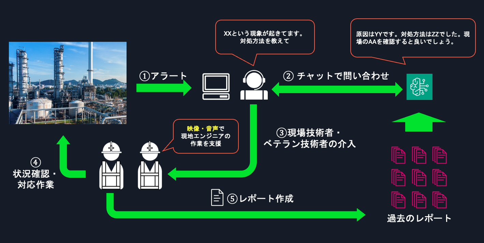
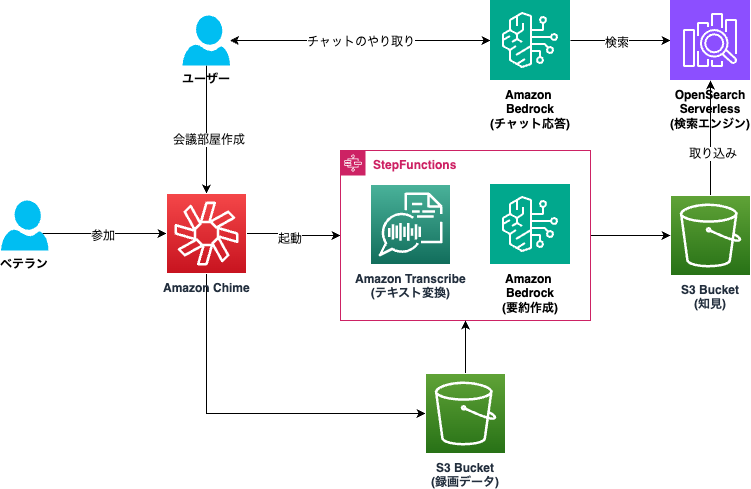
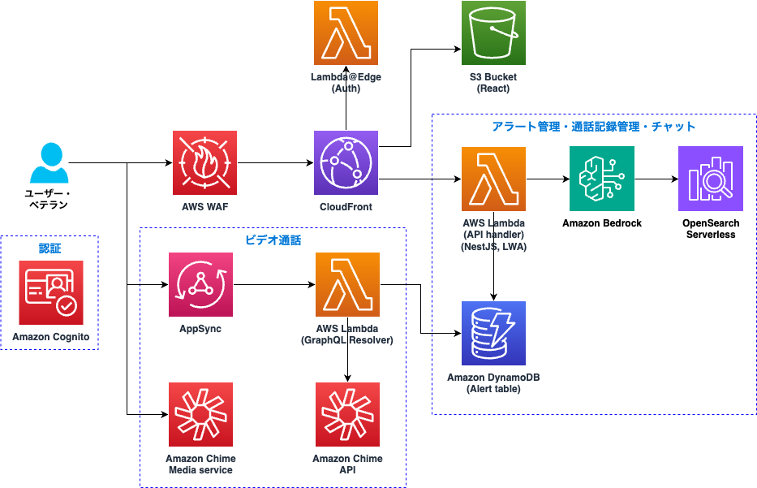
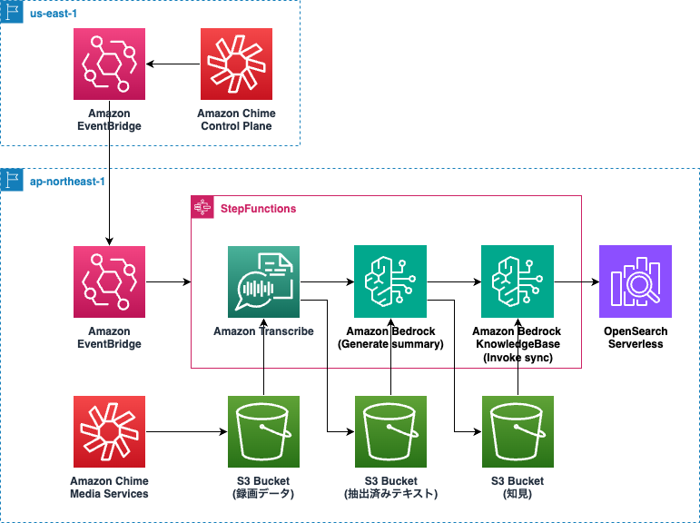

# 生成 AI による技能の伝承

## 背景

近年、生成 AI の登場により、人間のような自然な対話や文章生成が可能となっています。この技術は、製造業や IT 運用、ヘルスケア、教育など、多岐にわたる分野でのトラブル対応や意思決定支援に利用することが期待できます。

これらの分野で生成 AI を活用する際には、各企業や組織が保有する特有の明文化された知見を参照することが求められます。これを実現するためには、RAG（Retrieval-Augmented Generation）の活用が重要となります。RAG を通じて、AI は過去の記録や専門家の知見を検索・参照し、適切な回答を生成します。

しかし、特有の知見は必ずしも明文化されているわけではなく、また属人化しているケースも多々あります。このような場合には、human-in-the-loop の仕組みが有効です。これは、AI と人間が協力して、AI が解決できない問題に対処しながら知見を蓄積していく方法です。例えば下記の業界の例では、ビデオ通話により知見の蓄積を促すことができると考えられます。

- 製造業: 現場でのトラブル対応や熟練技術者のノウハウ伝承。生産ラインの異常検知や機器の故障対応において、生成 AI が過去の対応記録を参照しながら解決策を提示し、熟練技術者がビデオ通話で現場を確認して対処をサポートします。これにより、迅速かつ的確な対応が可能となり、技能が次世代に継承されます。

- IT 運用: サーバー障害やシステムトラブルのリアルタイム対応。AI が障害の根本原因を特定し、過去の解決策を参照して提案しますが、複雑な問題や新たな障害には、熟練の運用エンジニアがビデオ通話を通じて追加の指示を出し、迅速な復旧を図ります。これにより、知識の共有と技術の継承が可能になります。

- ヘルスケア: 遠隔医療や緊急対応での熟練医師のアドバイス。生成 AI が患者の症状や病歴をもとに診断や治療の提案を行い、熟練医師がビデオ通話を通じてリアルタイムで助言や治療方針を決定します。これにより、医療現場での知見が共有され、特に医療資源の乏しい地域での治療精度が向上します。

- 建設・インフラ保守: 現場での緊急対応やトラブル解決。老朽化したインフラ設備の維持管理や、建設現場での予期せぬトラブルに対して、AI が過去のデータを基に対処方法を提示し、熟練技術者がビデオ通話を通じて現場を確認し、適切な対応を指示します。これにより、緊急時の対応力が強化されます。

このサンプルは、ビデオ通話を通じて熟練者の知見を蓄積し、生成 AI がその知見を利用することで、将来的にトラブル対応が可能になる仕組みをデモします。この仕組みは、様々な業界での技能伝承やトラブル対応に活用できる可能性があります。

### 製造業における技能伝承の例

製造業では、熟練技術者が持つ現場でのノウハウや経験が、トラブル対応や生産プロセスの最適化に不可欠です。しかし、少子高齢化や熟練技術者の退職が進む中、こうした知見が属人化しており、次世代への伝承が課題となっています。特に地方の工場では、慢性的な人手不足が深刻で、熟練者からの技能伝承が一層難しくなっています。

生成 AI を活用することで、過去の対応記録や熟練技術者の知見を参照しながら、新たなトラブルにも対応できるようになります。例えば、生産ラインで異常が発生した際、AI が解決策を提示し、必要に応じてビデオ通話を通じて熟練技術者が現場を確認し、適切な対応を指示します。このやり取りは記録され、後続の技術者が参照することで、次世代への技能伝承が可能になります。

- オペレータは現場から発報されたアラートを確認する。
- オペレータは生成 AI チャットボットに問い合わせする。チャットボットは過去のレポートを元に原因・対処方法と、推奨される現場への確認アクションを応答する。
- オペレータは現地エンジニアにリモート通話で、AI から生成された応答を基に状況確認を依頼する。
- 現地エンジニアは実際の状況を確認後、対応作業を行う。もし原因究明や解決が困難な場合は、別途熟練者に通話に入っていただく。
- 対処が完了した場合、原因や対処法などをレポートに記載し保存する。

このような対応を繰り返すことで過去の対応履歴に熟練者のノウハウが蓄積されていき、熟練者が退職された後においてもその知見をうまく活用することができるようになると期待されます。詳細についてはこちらのブログ: 「[AWS Summit Japan 生成 AI で技能伝承！プロセス製造業デモのご紹介](https://aws.amazon.com/jp/blogs/news/aws-summit-japan-2024-generative-ai-demo-for-process-manufacturing/)」をご覧ください。

## アーキテクチャ

最初に human-in-the-loop を組み込んだ全体のアーキテクチャ、次にアプリケーションの構成、そして最後に録画パイプラインの詳細について順に紹介します。

### Human-in-the-loop

このアーキテクチャは、生成 AI と熟練者が協力して知見を蓄積し、AI がトラブル対応を支援する仕組みです。

- ユーザーは、生成 AI サービスである [Amazon Bedrock](https://aws.amazon.com/jp/bedrock/) を介してチャット形式で AI とやり取りします。
- AI は [RAG（Retrieval-Augmented Generation）](https://aws.amazon.com/jp/what-is/retrieval-augmented-generation/) の手法を用いて、[Amazon OpenSearch Serverless](https://aws.amazon.com/jp/opensearch-service/features/serverless/) から既存の知見を検索し、適切な回答を提供します。
- 既存の知見はあらかじめ S3 バケットに保存され、検索対象として利用されます。
- AI が対応できない新たなトラブルが発生した場合、ビデオ通話サービスである [Amazon Chime](https://aws.amazon.com/jp/chime/) を通じて、熟練者とリアルタイムでやり取りします。
- 通話終了後、録画された通話は [Amazon Transcribe](https://aws.amazon.com/jp/transcribe/) によってテキスト化され、その後、Amazon Bedrock が要約を作成し、新たな知見として追加されます。これにより、次回以降のトラブル対応では、この知見が RAG のデータソースとして利用され、回答率が向上します。

### アプリケーション

- フロントエンド: [Amazon CloudFront](https://aws.amazon.com/jp/cloudfront/) と [Amazon S3](https://aws.amazon.com/jp/s3/) で [React](https://react.dev/) アプリが配信され、ユーザーインターフェイスを提供します。
- 認証: [Amazon Cognito](https://aws.amazon.com/jp/cognito/) を使用してユーザー認証を行います。
- ビデオ通話: [AWS AppSync](https://aws.amazon.com/jp/appsync/)、[AWS Lambda](https://aws.amazon.com/jp/lambda/)、[Amazon Chime](https://aws.amazon.com/jp/chime/) を組み合わせて、ビデオ通話機能を提供します。
- バックエンド: アラート管理、通話記録管理、およびチャット機能は、AWS Lambda、Amazon Bedrock、[Amazon DynamoDB](https://aws.amazon.com/jp/dynamodb/)、Amazon OpenSearch Serverless によって実現されます。Lambda 上では、[AWS Lambda Web Adapter](https://github.com/awslabs/aws-lambda-web-adapter) を使用して [NestJS](https://nestjs.com/) アプリケーションが動作しています。

### 録画パイプライン

ビデオ通話が終了すると、以下のプロセスが自動的に実行されます。

- 通話終了を [Amazon EventBridge](https://aws.amazon.com/jp/eventbridge/) が検知し、[AWS Step Functions](https://aws.amazon.com/jp/step-functions/) を起動します。
- Step Functions では、通話録画をテキスト化（Amazon Transcribe）、要約作成（Amazon Bedrock）、および OpenSearch へのデータ取り込みを実行します。
- 生成された要約は、[Knowledge Base](https://docs.aws.amazon.com/ja_jp/bedrock/latest/userguide/knowledge-base.html) の API を通じて取り込まれ、次回のトラブル対応に利用されます。

このアーキテクチャにより、生成 AI と人間の知見が連携し、継続的な技能伝承が可能になります。

## コンテンツ

- [デプロイ方法](./docs/deploy.md)
- [デモを動かす](./docs/run_demo.md)
