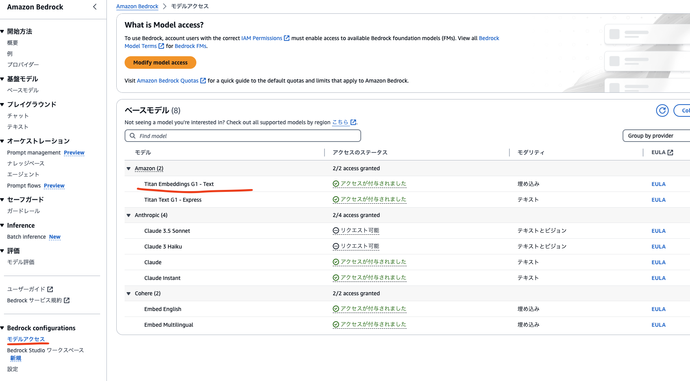
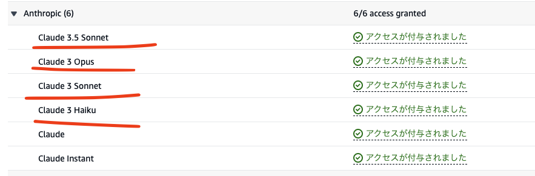

# デプロイ手順

## 生成AIモデルの有効化

生成AIモデルの有効化をマネージメントコンソール (以降マネコン) から行います。埋め込みモデル (Titan Embed Text v1)およびチャット応答モデル (Claude 3)の2種類のモデルを有効化する必要があります。

### 埋め込みモデル (Titan Embed Text v1)

マネコンから本サンプルのデプロイ先のリージョン (たとえばap-northeast-1など) > `Bedrock` > モデルアクセスをクリックし、Titan Embedding G1 - Textを有効化します。



### チャット応答モデル (Claude 3)

続いて、マネコンからチャット応答モデルのリージョン (デフォルトではus-west-2) > `Bedrock` > モデルアクセスから、Claude3モデルを有効化します。



> [!Important]
> チャット応答モデルのリージョンをus-west-2ではなく変更したい場合は、[cdk.json](../cdk/cdk.json)の`bedrockRegion`を変更します。詳しくは後述の「CDKでデプロイする」をご覧ください。

## CDKでデプロイする

- お手元に UNIX コマンドおよび Node.js, Docker 実行環境を用意してください。もし無い場合、[AWS EC2 Setup for Prototyping](https://github.com/aws-samples/ec2-setup-for-prototyping)がご利用可能です (SSHログインしご利用ください)。
- このリポジトリをクローンします

```sh
git clone https://github.com/aws-samples/industrial-knowledge-transfer-by-genai
```

- [esbuild](https://esbuild.github.io/)、[AWS CDK](https://aws.amazon.com/jp/cdk/)をインストールします

```sh
npm i -g esbuild
npm i -g aws-cdk
```

- プロジェクトが依存する npm パッケージをインストール後、ビルドします

```sh
cd industrial-knowledge-transfer-by-genai
npm install
npm run build
```

- CDK デプロイ前に、us-east-1リージョン、およびデプロイ先リージョンに対して 1 度だけ Bootstrap の作業が必要となります。ここでは東京リージョン (ap-northeast-1) へデプロイするものとします。なお\<account id\>はデプロイ先のアカウント ID に置換してください。

```sh
cd cdk
cdk bootstrap aws://<account id>/us-east-1
cdk bootstrap aws://<account id>/ap-northeast-1
```

- 必要に応じて[cdk.json](../cdk/cdk.json)の下記項目を編集します

  - `bedrockRegion`: チャット応答モデルを利用するリージョン (デフォルト: us-west-2)
  - `allowedIpV4AddressRanges`, `allowedIpV6AddressRanges`: 許可する IP アドレス範囲の指定

- プロジェクトをデプロイします。環境にもよりますが、20 分ほどかかります。

```sh
cdk deploy --require-approval never --all
```

- 下記のような出力が得られれば成功です。`KnowledgeTransferStack.DistributionUrl` に WEB アプリの URL が出力されますので、ブラウザからアクセスしてください。

```sh
 ✅  KnowledgeTransferStack

✨  Deployment time: 732.74s

Outputs:
...
KnowledgeTransferStack.DistributionUrl = https://xxxxxxx.cloudfront.net
...
Stack ARN:
arn:aws:cloudformation:ap-northeast-1:1234:stack/KnowledgeTransferStack/yyyy

✨  Total time: 762.56s
```

以上でデプロイ手順の解説を終えます。続いて[デモを動かす](./run_demo.md)へお進みください。

## トラブルシューティング

### CDK deploy

デプロイコマンドで[UsEast1Stack](../cdk/lib/us-east-1-stack.ts)および[KnowledgeTransferStack](../cdk/lib/knowledge-transfer-stack.ts)の2つのスタックがデプロイされますが、`KnowledgeTransferStack`はus-east-1「**以外**」のリージョンにデプロイする必要があります。デプロイ時に下記のエラー内容が表示された場合はデプロイ先のリージョンがus-east-1「**以外**」であることを確認ください。

```
CrossRegionEventRuleXXXX
Resource handler returned message: "Source EventBus and Target EventBus must not be the same.
```
