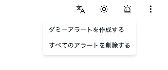
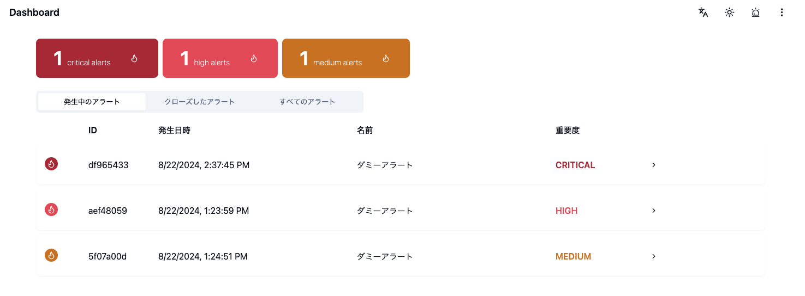
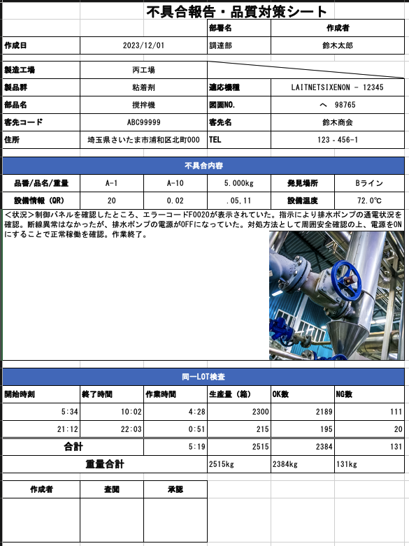
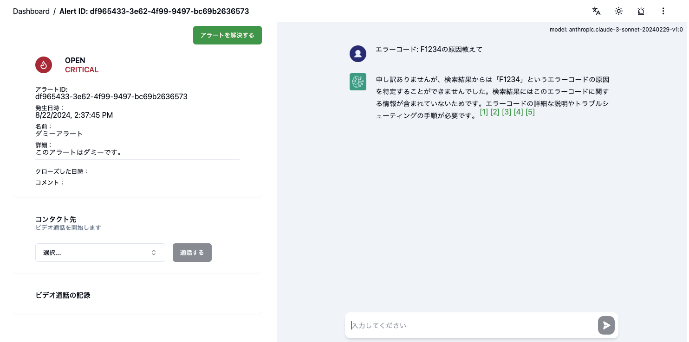
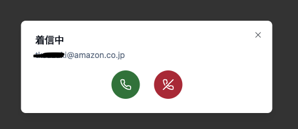
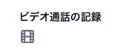
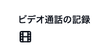
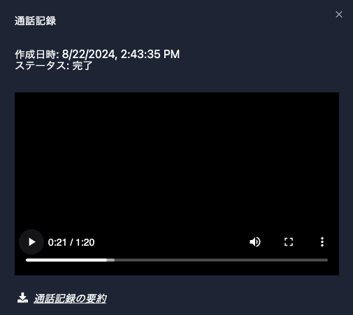
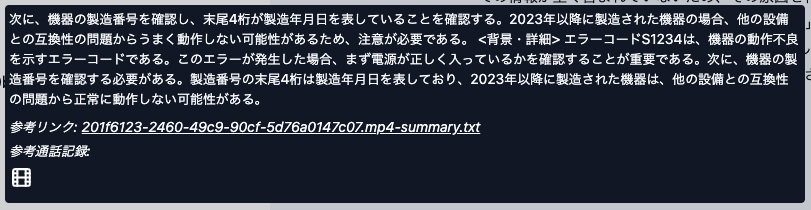

# デモを動かす

## 準備

### ユーザーの作成

アカウント作成画面でユーザーを作成します。この後ビデオ通話による動作確認を行うため、最低 2 名のユーザーを作成しておいてください。

### アラートの作成

ここではダミーのアラートを作成します。右上のアラートボタンからダミーアラートを作成可能です。

作成するとダッシュボードに表示されます。

なお、アラートの情報は[Alert 型](../backend/common/src/@types/alert.ts)で DynamoDB に管理されています。別途 DynamoDB に取り込むしくみを作成することで、より実際に即したデモが可能です。また、ダミーのアラートは[こちらのファイル](../backend/api/src/alert/alert.service.ts)の`createDummyAlert`にて作成しています。修正しデプロイ (具体的には`cdk deploy`) することで、任意のダミーアラートを作成することができます。

#### （例）製造業の場合

生産ラインの異常検知や機器の故障対応に対応したアラートを作成するには、たとえば[AWS IoT Core](https://aws.amazon.com/jp/iot-core/)がご利用できます。詳しくは[チュートリアル](https://docs.aws.amazon.com/ja_jp/iot/latest/developerguide/iot-ddb-rule.html)や[IoT Coreハンズオン](https://catalog.us-east-1.prod.workshops.aws/workshops/b3e0b830-79b8-4c1d-8a4c-e10406600035/ja-JP)を参照ください。

### (Optional) 既存の知見のアップロード

- AWS マネージメントコンソール (以降マネコン) から`CloudFormation` > `KnowledgeTransferStack` > `出力`タブに表示される`S3BucketsKnowledgeBucketNameXXX`の値を控えます。
- マネコンから`S3`の控えたバケット名を開きます。
- 「アップロード」ボタンをクリックし、事前に検索対象に加えたいドキュメントをアップロードします。.txt ファイルや.pdf の他、.docx, .xlsx などの形式がご利用いただけます。詳細は[公式ドキュメント](https://docs.aws.amazon.com/bedrock/latest/userguide/knowledge-base-ds.html)をご確認ください。
- マネコンから`Amazon Bedrock` > `ナレッジベース`にアクセスし、説明に「Industrial Knowledge Transfer By GenAI」と記載されたナレッジベースにアクセスします (名称は`
KBKnowledgeTrKnowledgeXXXXX`)。
- `データソース`> `knowledgetransferstack-s3bucketsknowledgebucketxxxx`を選択し、「同期」をクリックします。同期が完了すると OpenSearch にドキュメントが取り込まれます。

#### (例) 製造業の場合

既知の知見のサンプルとして[不具合報告シート](../sample/manufacturing/不具合報告シート/)がご利用いただけます。

## チャットとビデオ通話

### 生成 AI チャット (1 回目)

アラートをクリックすると詳細画面に遷移し、チャットが可能です。アラートの対処方法について質問することが可能です。既存の知見から回答できない場合は「この検索結果からは回答することができません。」などの応答が得られます。

### ビデオ通話

異なるブラウザや異なる端末を利用するなどし、異なるアカウントで同時にアプリケーションを開いた状態にしておきます。アラート詳細画面のコンタクト先から通話先のメールアドレスを指定し、「通話する」ボタンをクリックします。ダイアログが開き通話部屋が作成されます。

受け手側に着信の通知がきます。電話ボタンをクリックすると Chime によるビデオ通話が開始されます。マイクやビデオを ON にし、熟練者との会話を模擬した内容を話してみてください。

### 通話の記録

通話終了後、しばらくするとアラート詳細画面のビデオ通話の記録にアイコンが表示されます (薄い色のアイコンは動画保存処理中のため、濃い黒になるまでお待ちください)。

- 動画保存処理中

- 動画保存処理完了

アイコンをクリックすると、通話記録の動画を見ることができます。ステータスが「完了」となっている場合、通話記録の要約をダウンロードし参照することができます。

### 生成 AI チャット (2 回目)

適当なアラート詳細画面を開き、通話の内容に関連した質問をすると、その内容に基づいて回答されます。[1]など引用番号をクリックすることで、引用元の通話記録およびその要約を確認することができます。

> [!Important]
> 要約が完了してから KnowledgeBase への取り込みが行われるため、すぐには反映されていない可能性があります。もし 1 回目と同様「検索結果に見つからないため回答できません」などの文言が返された場合、数分待ってから再度お試しください。

