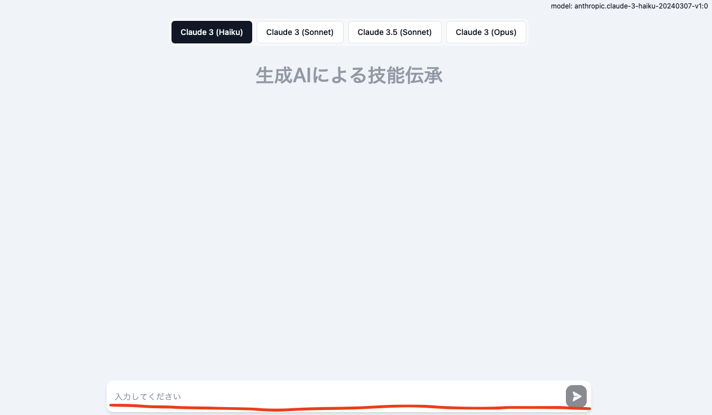

# デモを動かす

## 準備

### ユーザーの作成

アカウント作成画面でユーザーを作成します。この後ビデオ通話による動作確認を行うため、最低 2 名のユーザーを作成しておいてください。

### アラートの作成

ここではダミーのアラートを作成します。右上のアラートボタンからダミーアラートを作成可能です。

なお、アラートの情報は[Alert 型](../backend/common/src/@types/alert.ts)で DynamoDB に管理されています。別途 DynamoDB に取り込むしくみを作成することで、より実際に即したデモが可能です。

各業界のユースケース例: Comming soon

### (Optional) 既存の知見のアップロード

- AWS マネージメントコンソール (以降マネコン) から`CloudFormation` > `KnowledgeTransferStack` > `出力`タブに表示される`S3BucketsKnowledgeBucketNameXXX`の値を控えます。
- マネコンから`S3`の控えたバケット名を開きます。
- 「アップロード」ボタンをクリックし、事前に検索対象に加えたいドキュメントをアップロードします。.txt ファイルや.pdf の他、.docx, .xlsx などの形式がご利用いただけます。詳細は[公式ドキュメント](https://docs.aws.amazon.com/bedrock/latest/userguide/knowledge-base-ds.html)をご確認ください。
- マネコンから`Amazon Bedrock` > `ナレッジベース`にアクセスし、説明に「Industrial Knowledge Transfer By GenAI」と記載されたナレッジベースにアクセスします (名称は`
KBKnowledgeTrKnowledgeXXXXX`)。
- `データソース`> `knowledgetransferstack-s3bucketsknowledgebucketxxxx`を選択し、「同期」をクリックします。同期が完了すると OpenSearch にドキュメントが取り込まれます。

## チャットとビデオ通話

### 生成 AI チャット (1 回目)

アラートをクリックすると詳細画面に遷移し、チャットが可能です。アラートの対処方法について質問することが可能です。既存の知見から回答できない場合は「この検索結果からは回答することができません。」などの応答が得られます。

### ビデオ通話

異なるブラウザや異なる端末を利用するなどし、異なるアカウントで同時にアプリケーションを開いた状態にしておきます。アラート詳細画面のコンタクト先から通話先のメールアドレスを指定し、「通話する」ボタンをクリックします。ダイアログが開き通話が開始されます。

### 通話の記録

通話終了後、しばらくするとアラート詳細画面のビデオ通話の記録にアイコンが表示されます (薄い色のアイコンは処理中のため、濃い黒になるまでお待ちください)。

アイコンをクリックすると、通話記録の動画を見ることができます。ステータスが「完了」となっている場合、通話記録の要約をダウンロードし参照することができます。

### 生成 AI チャット (2 回目)

適当なアラート詳細画面を開き、通話の内容に関連した質問をすると、その内容に基づいて回答されます。
